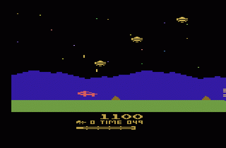
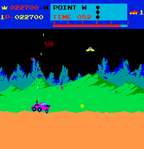

# Moon Patrol UMB
- Repository for classic game Moon Patrol made by students of UMB.
- Developers: @VOJAKIS, @Voltrifrodec

## Poznámky
- **Deadline**: 30. apríla 2023
- Nie je potrebné spisovať dokumentáciu (postup vyvíjania projektu), ale je potrebné, aby bol projekt vytvorený po etapách

### Etapy
Etapy by bolo vhodné buď dávať ako Tag, alebo ako Release (no skorej ako Tag)

#### Prvá etapa: Základné funkcie
- v hre existujú základné objekty (pozadie, hráč, zem)
- viem sa pohybovať dopredu, dozadu
- viem skákať
- zem sa pohybuje -- generovanie prekážok
- ak narazím na prekážku, tak sa aplikácia ukončí
- pridanie skóre

#### Druhá etapa: Pridanie nepriateľa
- zobrazenie nepriateľa na opačnú stranu okna po náhodnom čase
- nepriateľ sa pohybuje rovnako rýchlo ako zem
- ak narazím do nepriateľa, tak sa aplikácia ukončí

#### Tretia etapa: Pimping I
- pridanie pozadie hry a textúru pre zem
- pridanie textúry pre hráča a nepriateľa
- zmena veľkosti okna
- pridanie možnosti pozastaviť hru stlačením klávesy `P`
- reset hry dvojitým stlačením klávesy `R`
- pridanie textu o nastaveniach pod okno hry
- pridanie časovača

#### Štvrtá etapa: Pimping II
- pridanie tried objektov, tried hráča a nepriateľa
- pridanie aktuálnej hry do scény
- optimalizácia kódu (= vymazanie nadbytočných častí kódu)

#### Piata etapa: Pridanie nových funkcií
- pridanie lietajúcich nepriateľov
- mobilizácia hry: pridanie možnosti nepriateľov strieľať, ale taktiež pridanie zbrane pre hráča (alebo aj nie, možno príliš zložité)

#### Šiesta etapa: Finalizácia
- pridávania extra funkcií ako je zvuk, scény apod.
- finalizácia hry (kontrola kódu, oprava bugov, apod.)

## Užitočné odkazy a materiály

- Ukážka ako vypadala hra na Atari 2600: 

- Neskoršia verzia hry: 

